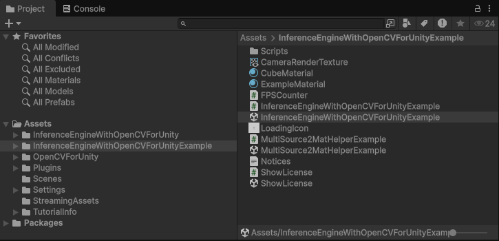
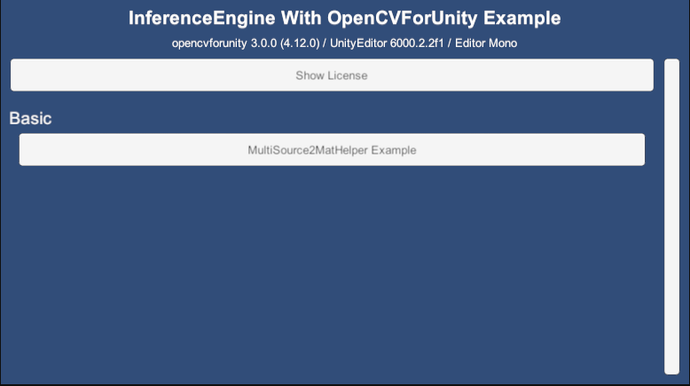
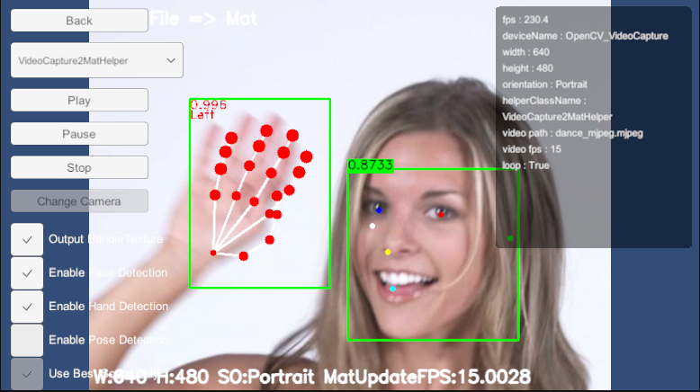

# InferenceEngine With OpenCVForUnity Example

## Overview

- Integrate **Unity Inference Engine** with **OpenCV for Unity**.

## Environment

- **Unity 6000.2.2f1+**
- [OpenCV for Unity](https://assetstore.unity.com/packages/tools/integration/opencv-for-unity-21088?aid=1011l4ehR) **3.0.0+**
- [Inference Engine](https://docs.unity3d.com/Packages/com.unity.ai.inference@2.3/manual/index.html) **2.3.0+**

## Setup

1. Download the latest release unitypackage from [InferenceEngineWithOpenCVForUnityExample.unitypackage](https://github.com/EnoxSoftware/InferenceEngineWithOpenCVForUnityExample/releases).
2. Create a new project. *(ex. InferenceEngineWithOpenCVForUnityExample)*
3. Import `Inference Engine` from `Package Manager`.
4. Import and Setup [OpenCV for Unity](https://assetstore.unity.com/packages/tools/integration/opencv-for-unity-21088?aid=1011l4ehR).
5. Import [InferenceEngineWithOpenCVForUnityExample.unitypackage](https://github.com/EnoxSoftware/InferenceEngineWithOpenCVForUnityExample/releases).
6. Add all of the `***.unity` files in the `InferenceEngineWithOpenCVForUnityExample` folder to `Build Settings` → `Scenes In Build`.
7. Build and Deploy.  
    

## Demo

- **Web** (WebGPU): [Play Demo](https://enoxsoftware.github.io/InferenceEngineWithOpenCVForUnityExample/webgl_example/index.html)
- **Web** (WebGPU, simd): [Play Demo](https://enoxsoftware.github.io/InferenceEngineWithOpenCVForUnityExample/webgl_example_simd/index.html)
- **Web** (WebGPU, simd, threads): [Play Demo](https://enoxsoftware.github.io/InferenceEngineWithOpenCVForUnityExample/webgl_example_simd_threads/index.html)
- **Android**: [Download APK](https://github.com/EnoxSoftware/InferenceEngineWithOpenCVForUnityExample/releases)

## ScreenShot

